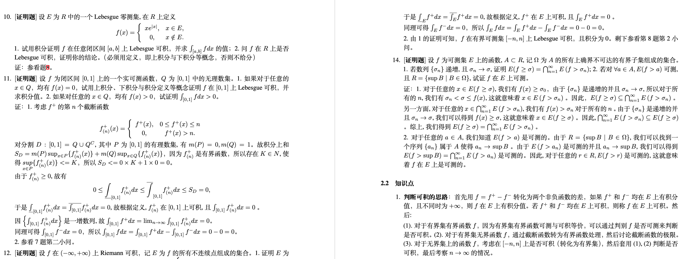

## 📌 预览

## :star: Change Log
* 2024-09-09 上传文件

## :sunflower: 使用须知
这是中科大实变函数与泛函分析习题集，整理于2023年秋季学期，上课老师是殷保群老师。

在复习时期，本人发现尽管复习资料非常丰富，但是基本都是手写资料的扫描版，不利于阅读和打印。因此，在前人资料的基础上，用Latex重新整理了相关资料，并详细的写了一份习题解答。

上传GitHub是希望通过公开Latex源码，方便大家增添自己的内容。如果大家有开源的意愿，也欢迎提PR一起完善本文档:rocket:。

## :heart: 赞助
如果觉得这份资料对你有帮助，可以请我喝杯咖啡 :coffee: ~

